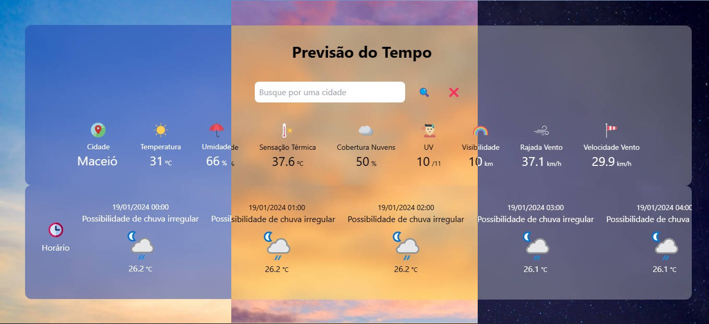
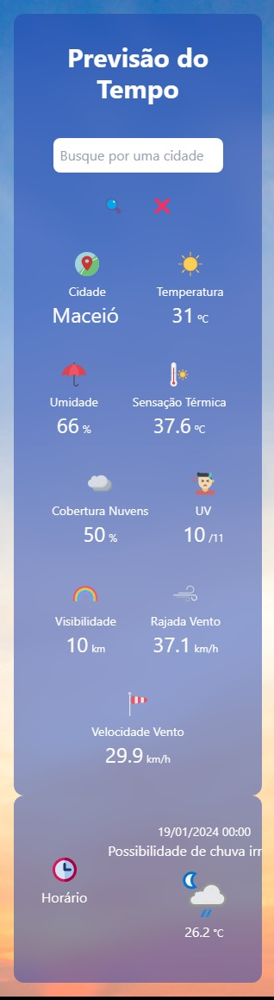
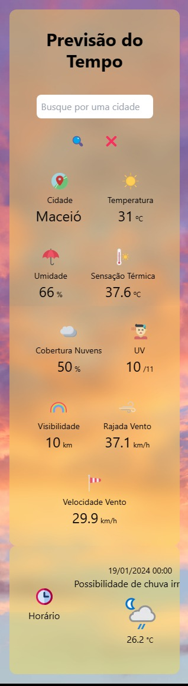

<h2>Previsão do tempo</h2>

Um projeto que consulta em tempo real os dados meteorológicos da sua região, basta digitar o nome da sua cidade para realizar uma busca completa, incluindo os seguintes dados:

<ul>
<li>☀️ Temperatura Atual</li>
<li>☀️ Umidade</li>
<li>☀️ Sensação Térmica</li>
<li>☀️ Cobertura de Nuvens</li>
<li>☀️ Índice UV</li>
<li>☀️ Visibilidade</li>
<li>☀️ Rajada de Vento</li>
<li>☀️ Velocidade do Vento</li>
</ul>

⏰ Inclui também os dados atualizados do dia (24hrs)

🌡️ Versão Mobile (celular) e Desktop (PC) com total responsividade

🎨 Background do app muda conforme o horário do dia do usuário

<strong>Link do projeto:</strong> <a href="https://previsao-do-tempo-3nvkav6cg-edijunior88.vercel.app/" target="_blank" >https://previsao-do-tempo-3nvkav6cg-edijunior88.vercel.app/</a>

<h3><strong>Modo Desktop</strong></h3>

  

 

<h3><strong>Modo Mobile</strong></h3>

  <table>
  <tr>
    <td>
      
    </td>
    <td>
      
    </td>
    <td>
      
    </td>
  </tr>
</table>

<h3><strong>Tecnologias Utilizadas</strong></h3>

<table>
  <tr>
    <td></td>
    <td></td>
    <td></td>
    <td></td>
    <td></td>
  </tr>
  
  <tr>
    <td></td>
    <td></td>
    <td></td>
    <td></td>
    <td></td>
  </tr>
</table>

<h3>Status do Deploy</h3>

<h3>Status da Issue</h3>

<h3>Tempo no projeto</h3>

 

<h4><b>Status do projeto:</b> ✅ Concluído</h4>
